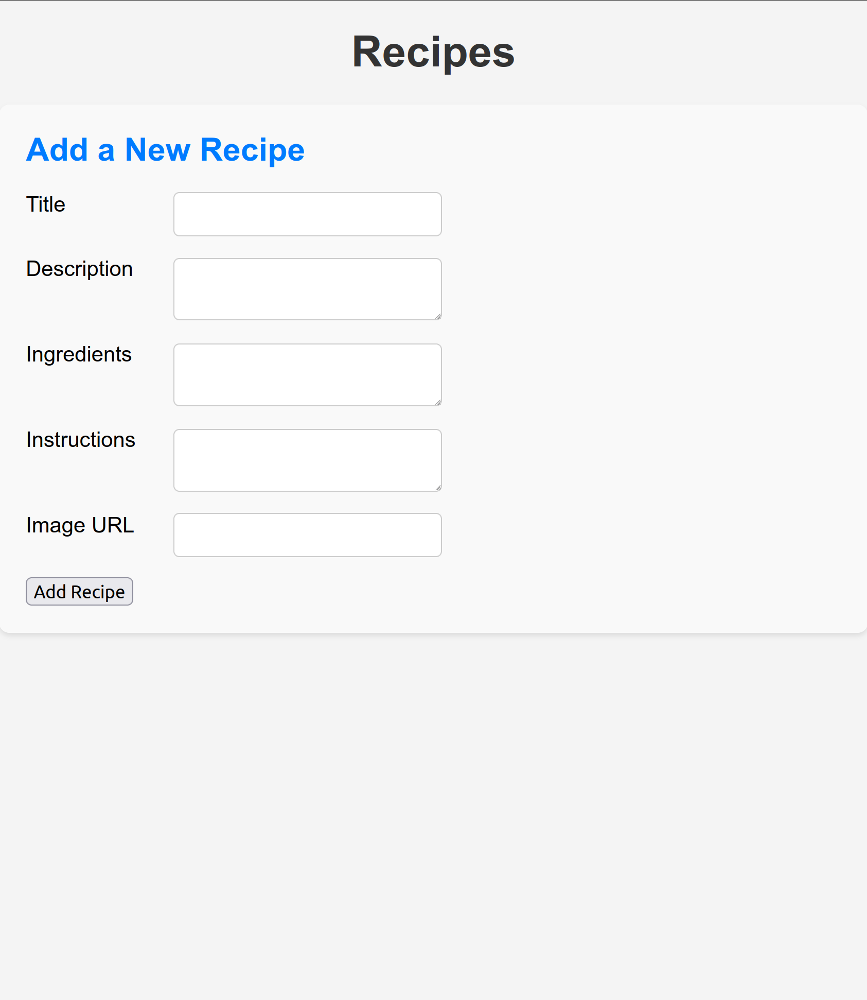
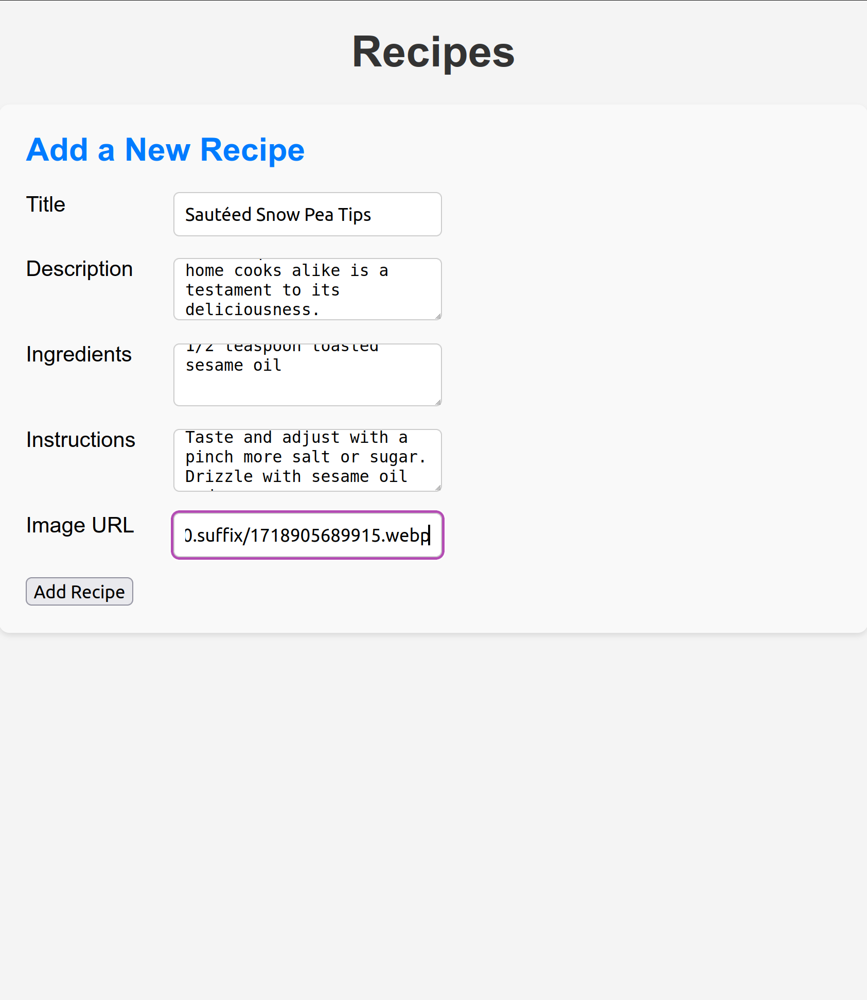
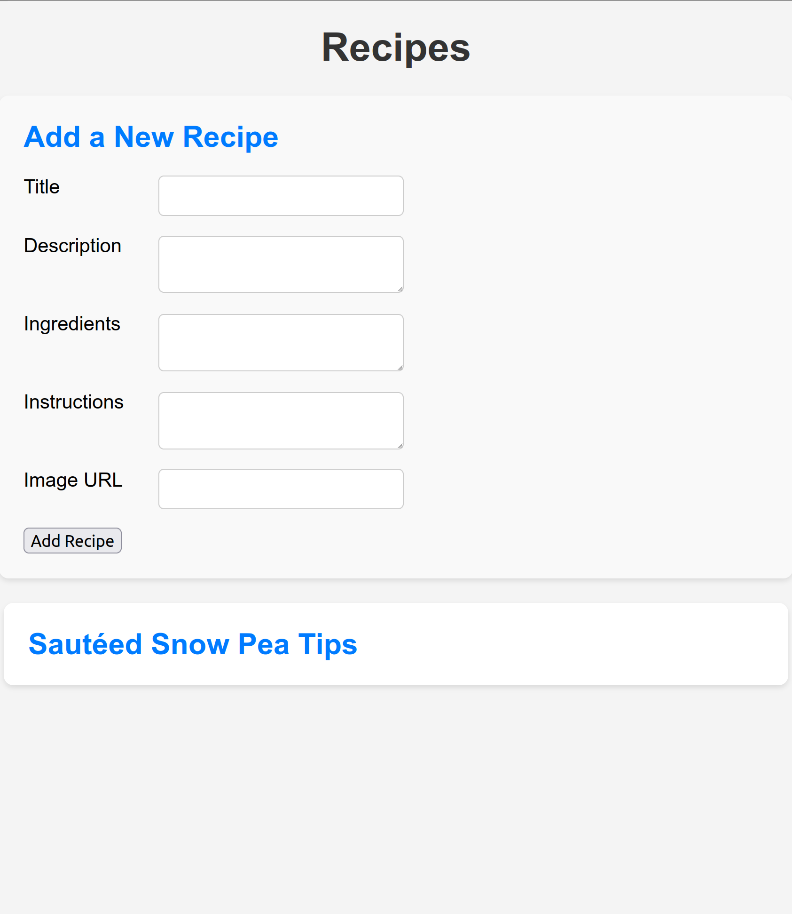
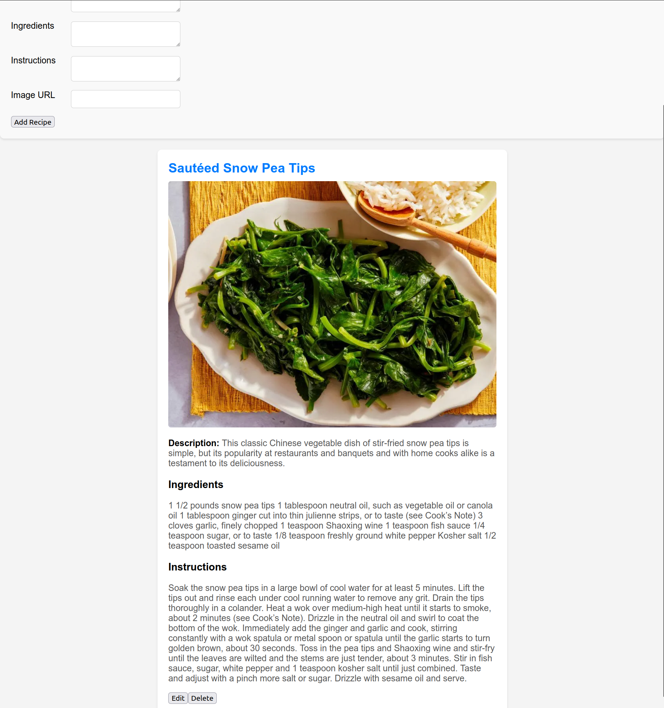
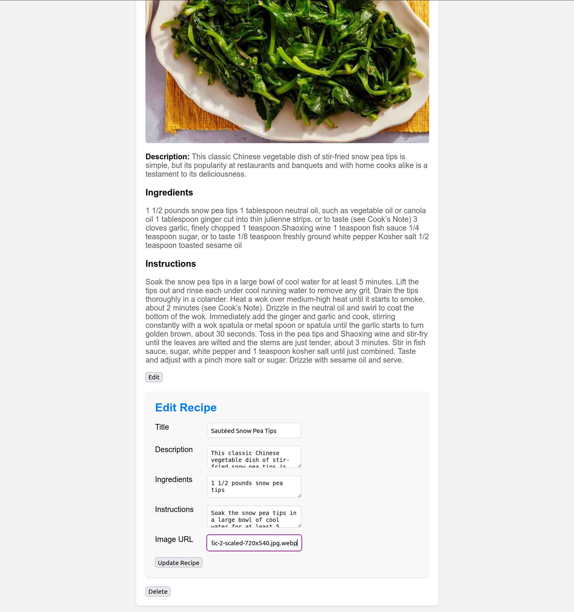
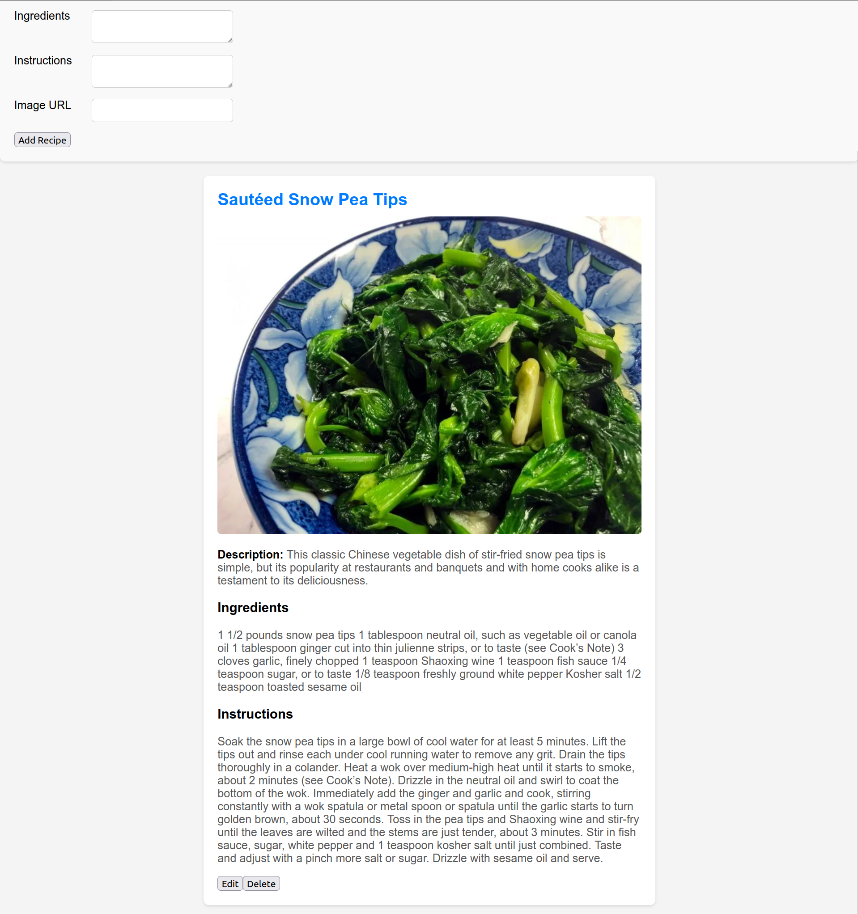
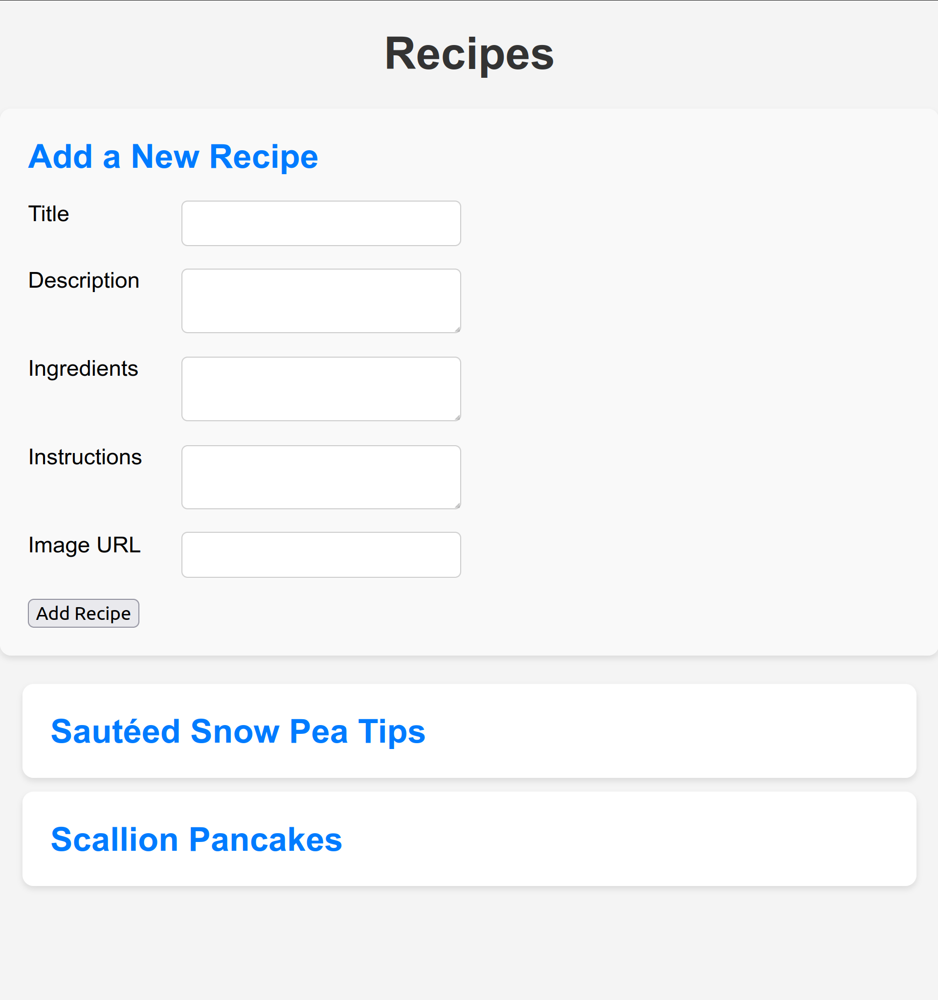
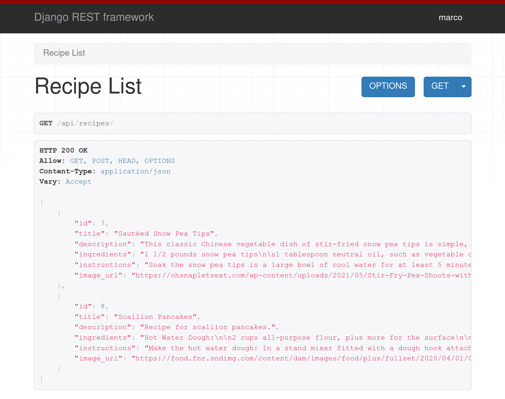
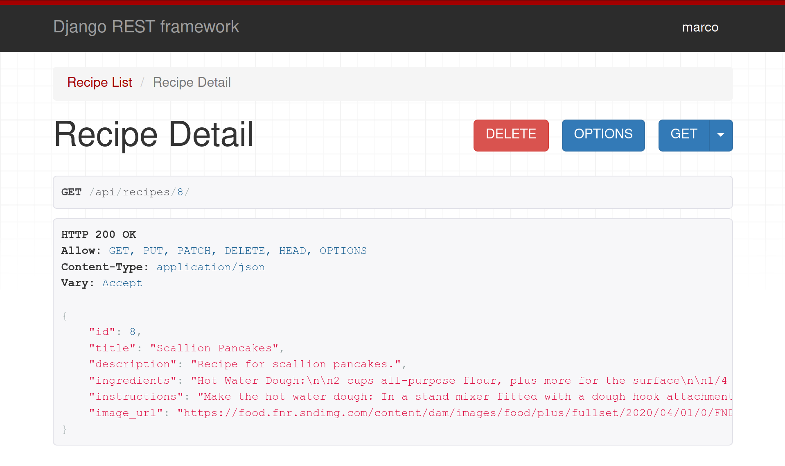

# Recipe Management App

A web application for managing recipes, built with Django (backend) and React (frontend). Users can view, add, update, and delete recipes with ease.

## Features

- **View Recipes**: Browse a list of recipes with details.
- **Add Recipes**: Create new recipes with titles, descriptions, ingredients, instructions, and images.
- **Update Recipes**: Edit existing recipes.
- **Delete Recipes**: Remove recipes from the list.

## Tech Stack

- **Frontend**: React, Axios
- **Backend**: Django, Django REST Framework
- **Database**: SQLite (default)

## API Endpoints

- `GET /api/recipes/`: Retrieve all recipes.
- `POST /api/recipes/`: Create a new recipe.
- `GET /api/recipes/<int:pk>/`: Retrieve a specific recipe.
- `PUT/PATCH /api/recipes/<int:pk>/`: Update a specific recipe.
- `DELETE /api/recipes/<int:pk>/`: Delete a specific recipe.

## Features

*Empty dashboard*

*Adding a new recipe*

*Added recipe*

*Expanded recipe*

*Editing existing recipe*

*Updated recipe*

*Multiple recipes*

*`GET /api/recipes/` endpoint*

*`GET /api/recipes/<int:pk>/` endpoint example*

